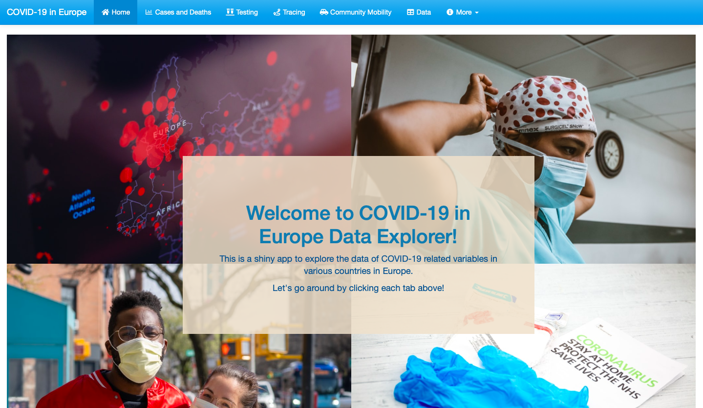
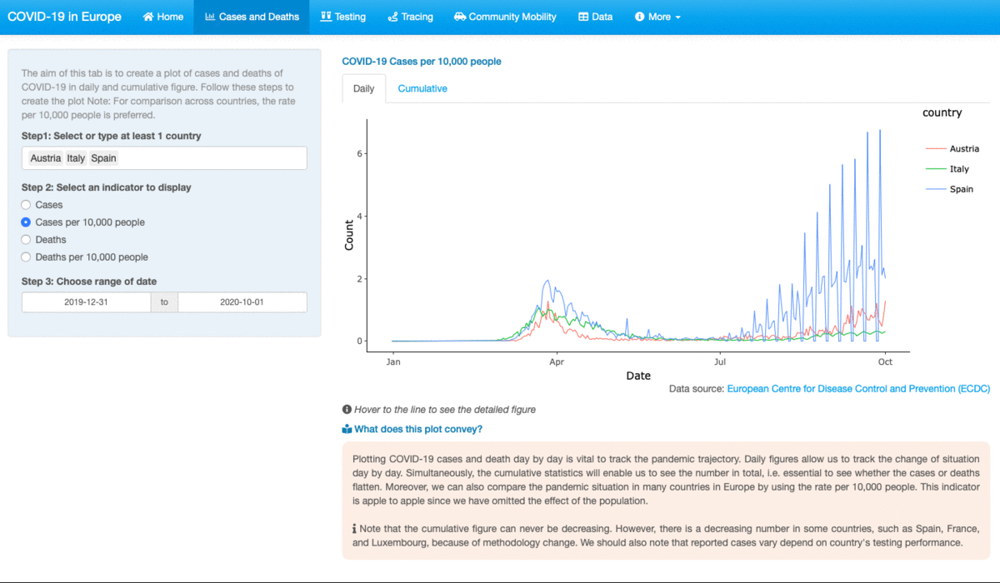

<style>
body {
text-align: justify}
</style>

```{r setup, include=FALSE}
knitr::opts_chunk$set(echo = FALSE)
```

```{css, echo = FALSE}


html, body, p {
  
  font-family: 'Lato', sans-serif;
  font-weight: 300;
  line-height: 1.3; 
  font-size: 1.0em;
  color: black;
  font-style: normal;
  
}

```


*The sky is only the limit*. It might sound hyperbolic, but this is what I would say when talking about R and all of its packages. In other words, I would say that you basically can make anything straight from R, from a report, a gif image, a presentation slides, a letter,  even a website, not to mention the statistical analysis, from the basic to the sophisticated one. 


In this article, I would like to discuss an interactive web app that I made with one of its packages, [Shiny](https://shiny.rstudio.com/). The discussion would be about the app itself and a self-review about the app. I developed this app as part of ETC5523 Communicating with Data assignment, one of the core units in the [Master of Business Analytics program](https://www.monash.edu/study/courses/find-a-course/2021/business-analytics-b6022?gclid=CjwKCAjww5r8BRB6EiwArcckC1oGdcqoRx9Uc8Pe3wqknW1rRa7GJ6VnTdCAddOlXoslHPw9ojQhrxoCIjAQAvD_BwE&international=true), Monash University. 


```{r prev-image, fig.cap="The landing page of the app", preview = TRUE}

```


```{r}

```


