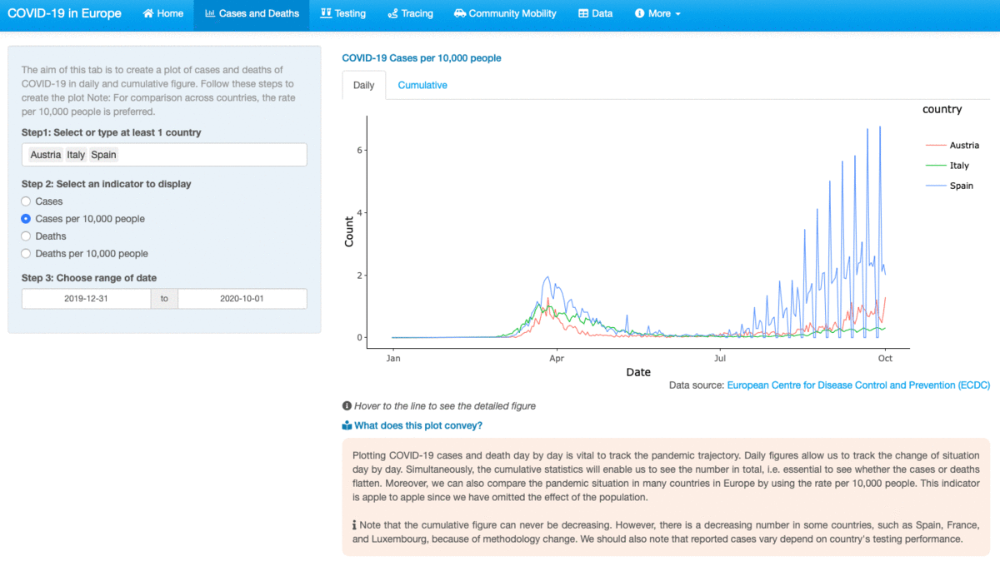
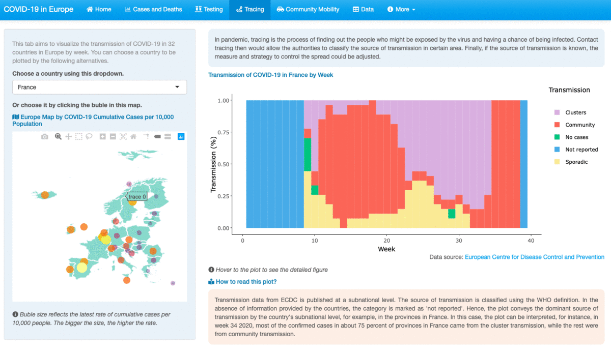
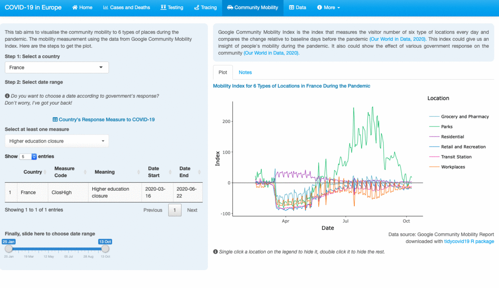

<style>
body {
text-align: justify}
</style>

```{r setup, include=FALSE}
knitr::opts_chunk$set(echo = FALSE)
```

```{css, echo = FALSE}


html, body, p {
  
  font-family: 'Lato', sans-serif;
  font-weight: 300;
  line-height: 1.3; 
  font-size: 0.95em;
  color: black;
  font-style: normal;
  
}

ul li{
 font-family: 'Lato', sans-serif;
  font-weight: 300;
  line-height: 1.3; 
  font-size: 0.95em;
  color: black;
  font-style: normal;
}

```


*The sky is only the limit*. It might sound hyperbolic, but this is what I would say when talking about R and all of its packages. In other words, I would say that you basically can make anything straight from R, from a report, a gif image, a presentation slides, a letter,  even a website, not to mention the statistical analysis, from the basic to the sophisticated one. 


In this article, I would like to discuss an interactive web app that I made with one of its packages, [Shiny](https://shiny.rstudio.com/) developed by Winston Chang, Joe Cheng, JJ Allaire, Yihui Xie, and Jonathan McPherson @shiny. The discussion would be about the app itself and a self-review about the app. I developed this app as part of ETC5523 Communicating with Data assignment, one of the core units in the [Master of Business Analytics program](https://www.monash.edu/study/courses/find-a-course/2021/business-analytics-b6022?gclid=CjwKCAjww5r8BRB6EiwArcckC1oGdcqoRx9Uc8Pe3wqknW1rRa7GJ6VnTdCAddOlXoslHPw9ojQhrxoCIjAQAvD_BwE&international=true), Monash University. 

```{r prev-image, fig.cap="The landing page of the app", preview = TRUE}
knitr::include_graphics("shiny_gif/prev_image.png")
```

<h2> `r fontawesome::fa("chart-line", fill = "#117A65")` <span style="color:#117A65"> <strong> About the app </strong> </span> </h2>

I named the app COVID19-EUxplorer: a COVID-19 in Europe Data Explorer. The reason I made a data explorer app is because data is essential in the fight against COVID-19. It helps governments and health sector authorities to measure policy. It can even help us, as part of the community, understand the current situation, and how we can play a role, hand in hand, to prevent the wider transmission. Hence, the aim of this app is a tool to explore the data of COVID-19 related variables in various countries in Europe. 

Further, there are two reasons I chose Europe as the region to explore:

- Some countries in Europe have experienced an increase in positive cases after previously having decreased cases [@conv]. Hence, there is a possibility of an increasing severity of the pandemic in this region given the geographic conditions i.e. the country is close one to another. Moreover, some countries have lifted the lockdown restriction. 
- The data available for Europe includes many indicators, not only limited to confirmed cases and deaths. Hence it is suitable for use in a data exploration app. 

```{r my-shiny, fig.cap = "The overview of the app"}

```


This app comprises of seven tabs as follows:

<p> `r fontawesome::fa("home", fill = "#117A65")` <span style="color:#117A65"> <strong> Home tab </strong> </span> </p>

The content of Home tab or the landing page as we can see in Figure \@ref(fig:prev-image) is a very brief overview of the app. It also urges the user to explore the app through the tabs. 

<p> `r fontawesome::fa("chart-bar", fill = "#117A65")` <span style="color:#117A65"> <strong> Cases and Deaths tab </strong> </span> </p>

This tab aims to visualize the cases and deaths of COVID-19 in 51 countries in Europe in daily and cumulative figure. Further, the users are allowed to choose the indicators they want to display: 1. Cases; 2. Cases per 10,000 population; 3. Deaths; and 4. Deaths per 10,000 population. The users also can compare between countries and choose the time range they want. 

<details><summary> See the tab here </summary>

```{r tab-1, fig.cap = "The display of Cases and Deaths tab"}
knitr::include_graphics("shiny_gif/tab_1.gif")
```

</details>

<br>

<p> `r fontawesome::fa("vials", fill = "#117A65")` <span style="color:#117A65"> <strong> Testing tab </strong> </span> </p>

This tab comprises of the visualization of testing and positivity rate of COVID-19 for country members of the European Union (EU)/European Economic Area (EEA) and the United Kingdom weekly. Just like the previous tab, the users are also allowed to choose multiple countries and week range. The plots also come with a benchmark line, i.e., the recommended testing and positivity rate for each corresponding chart. 

<details><summary> See the tab here </summary>

```{r tab-2, fig.cap = "The display of Testing tab"}
knitr::include_graphics("shiny_gif/tab_2.gif")
```

</details>
<br>

<p> `r fontawesome::fa("route", fill = "#117A65")` <span style="color:#117A65"> <strong> Tracing tab </strong> </span> </p>

This tab aims to explore the tracing of COVID-19 for country members of the EU / EEA and the United Kingdom. The tracing indicator is approached with the dominant transmission in each country. In this tab, the users can only choose one country. However, they are still able to compare the dominant transmission from week to week. Apart from selecting a country via the dropdown button, users can also set a country by clicking the map's bubble. The bubble size reflects the rate of COVID-19 cases per 10,000 people. Hence, in choosing the country for exploration, the users can use this map as a benchmark.

<details><summary> See the tab here </summary>

```{r tab-3, fig.cap = "The display of Tracing tab"}

```
</details>
<br>

<p> `r fontawesome::fa("route", fill = "#117A65")` <span style="color:#117A65"> <strong> Community Mobility tab </strong> </span> </p>

The objective of this tab is to explore the mobility of people during the pandemic in six types of locations daily. The users are allowed to choose a country to be displayed. The users also can choose the time range. I also added an interactive table of country response measure, which shows the start date and the end date of a measure. Since community mobility is developed to observe the effect of measure to the community activity, this table is useful as a benchmark of choosing the date to track that effect. 

<details><summary> See the tab here </summary>

```{r tab-4, fig.cap = "The display of Community Mobility tab"}

```

</details>
<br>

<p> `r fontawesome::fa("table", fill = "#117A65")` <span style="color:#117A65"> <strong> Data tab </strong> </span> </p>

This tab displays the raw data that are used to visualize the variables in the previous tabs. The users are allowed to choose one or more countries, even select all of the countries available. They are also allowed to choose the time range. 

<details><summary> See the tab here </summary>
```{r tab-5, fig.cap = "The display of Data tab"}
knitr::include_graphics("shiny_gif/tab_5.gif")
```
</details>
<br>

<p> `r fontawesome::fa("info-circle", fill = "#117A65")` <span style="color:#117A65"> <strong> More tab </strong> </span> </p>

This tab has two sub-tabs: About and References. The About sub-tab specifies the purpose of the app and other relevant information, such as the data source used in the app and the R packages to make the app. I also wrote a brief information about my self as the creator of the app. The References sub-tab conveys the reference of data sources, readings, packages, and images used in the app.

<details><summary> See the tab here </summary>
```{r more-tab, fig.cap = "The display of More tab"}

knitr::include_graphics("shiny_gif/more.gif")

```
</details>
<br>

<h2> `r fontawesome::fa("book-reader", fill = "#117A65")` <span style="color:#117A65"> <strong> Self Review </strong> </span> </h2>


```{r thanks, fig.cap = "Source: giphy.com"}

knitr::include_graphics("https://media4.giphy.com/media/WZ4M8M2VbauEo/giphy.gif?cid=ecf05e47izbocuzr65qzaq00i0kvaosw71t5aqri9lmbgbb7&rid=giphy.gif")

```

Self-evaluation is an essential mechanism in learning. For me, it is kind of a way to track my journey on learning something new. The future me could go back to this review and see how far I've progressed. Most importantly, I could use this self-critics to make a better app in the future. 


<h3> <span style="color:#117A65">  What I've done well  </span> </h3>

Overall, I feel that I have done pretty well in following all the prompts given in the project's instruction. Additionally, I also made some tweaks that I hope could improve the app's functionality as a whole, including:

- Substantially, this app covers various variables, not only cases and deaths, but also the testing and positivity rates, the dominant transmission, the people's mobility, and even the government measure. I realized that many variables made it possible to make the app less focused. Hence, I separated these variables into several tabs. I hope that this division would make the app is compact and easy to use.    
- To achieve its goal as a data explorer, this app gives users a full flexibility in choosing the variables to display. This app also supports the flexibility of time-wise comparison in a specific country or some countries at once.
- An additional instruction below each plot to enhance the information conveyed by the visualization. For example: "Hover to the line to see a detailed figure."

<h3> <span style="color:#117A65">  Area for improvement  </span> </h3>

That said, I realized that this app has still had some weaknesses. Some weaknesses related to the app's display and functionality could be fixed by adding extra tweaking. The other improvement could not be done immediately due to the limitation of data or technology. Here I will list out which one of the app's limitations falls to which category and future actions to improve the app.

<p> <span style="color:#117A65"> <strong> Plausible improvement </strong> </span> </p>

- I would improve the landing page by adding the clickable link to each tab below the box. Hence, the user could follow the tab right after reading the text in the box rather than scroll up the page again to find the top's navigation bar. 
- Just like the dashed lines in the testing and positivity rate plots, I wish I have also added a dashed line of the average cases and deaths rate per 10,000 population in Europe. This addition would add another insight to the users in making a comparison. 
- I would add a custom color for each country in the plots in "Cases and Death" and the "Testing" tab. Thus, each country's color is consistent even though any new country is added to the plot.
- In the app, the x-axis label sequence in the daily-wise plots is still by three months. I should have changed it into monthly.
- For the weekly based plots, I should have added a definition of when week 1 started. Although this information is available in the data table, I realized that the users might not be able to find it immediately. 
- In the Tracing and the Community Mobility tab, I feel like the information is all over the place. It would have been better if I used a fluidRow column to design a better layout. The layout might be adapting to [this app](https://analytics-modeling.shinyapps.io/outbreakdetection/). Unfortunately, I was getting used to using the fluidRow near the project's due when everything has set up. 
- Transmission chart is likely hard to read. However, I have give an explanation on how to read the plot.   
- I wish I have changed the slider input to choose the date range into a date input in the Community Mobility tab. This change would allow the user to quickly select the date according to the measure without having to slide back and forth to find the exact date. 
- Last but not least, I should have given a comma separation to the population column in the data tables. Hence, the population figure would be more readable. 


<p> <span style="color:#117A65"> <strong> App goals </strong> </span> </p>

The goal of this app in the future is an automatically updated data in the weekly testing and positivity rate and the weekly dominant transmission variables. The current app needs manual data feeding since the file name of the data in the European Centre of Disease Control and Prevention (ECDC) website, the data source of these variables, is always changed every time they update the data. Thus, the URL read code in R would not work in this case. 

Another feature that I want to add is a forecasting or simulation feature just like this  [app](https://analytics-tools.shinyapps.io/covid19simulator02/), developed by MGH Institute for Technology Assessment, Harvard Medical School @mghharvard. 

```{r mgh, fig.cap = "COVID-19 simulator"}

knitr::include_graphics("shiny_gif/mgh_harvard.png")

```

Currently, this feature could not be added not because of the limitation of data and technology, but the limit of my knowledge. Hence, I think I should enhance my knowledge and skill regarding forecasting and simulation, or another feasible way is to collaborate with others. 


<p> <span style="color:#117A65"> <strong> Final Note </strong> </span> </p>

I learned a lot of valuable lessons in making this first app. Not only it builds up my skill technically in creating an app, but also, most importantly, I learned that in making an app, we must always put our perspective as the users. Hence, it will improve the user interface and the user experience along the way the app is built.

